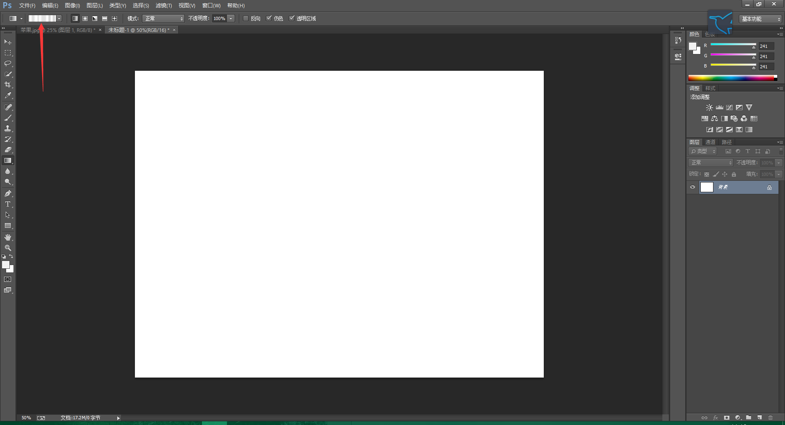
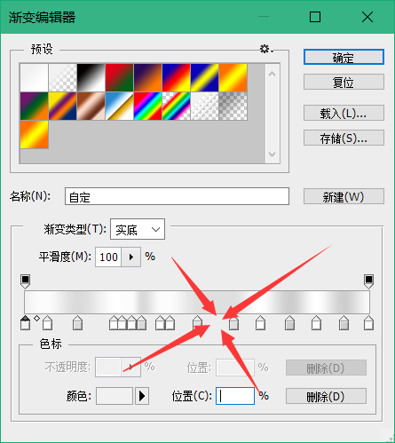
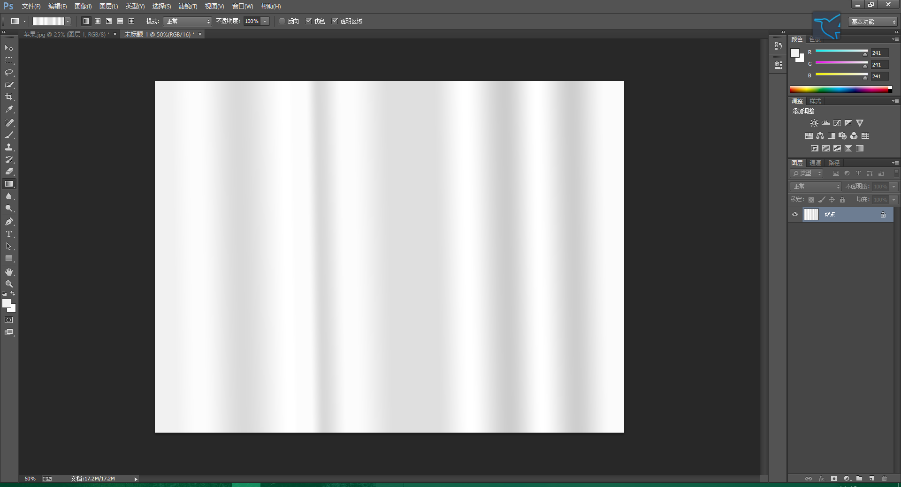
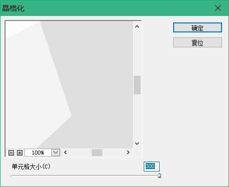
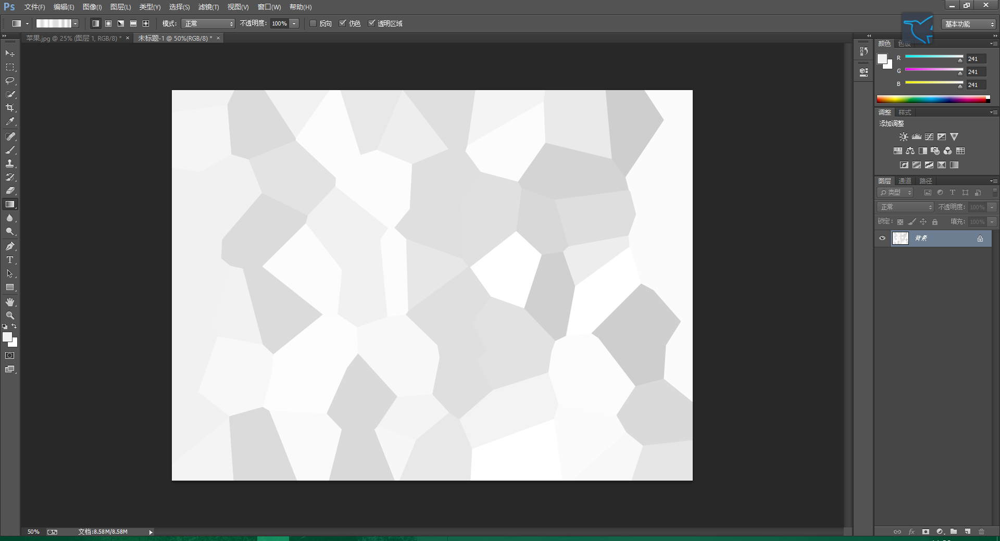

# 写在开始
我的上一篇博客有写关于背景的一些设计方式,其中一种就是用lowpoly风格的背景,现在我填一下这个坑.
# 写一种最简单的方式
打开ps,然后新建一个图层,没的说吧.

找到渐变工具.

然后点击这里:

然后会打开这里:

然后点击这里这样的地方:

多添加几个颜色,像我这样.

然后对着背景一划:

然后就成这样了:

注意这里有一个坑,那就是图像一定要是8通道的,16和32通道的图片是不能做下一步操作的.
下一步操作就是点滤镜里面的像素花里面的晶格化.

然后设置一下单元格大小,这个大小取决于你的图像的分辨率,因为我的是2000x1500的,所以拉到了最大.

然后图像就成这样了.

基本上这是比较省事的方式来生成lowpoly风格的图像的,然后如果想用别的颜色的话在渐变编辑器里把灰色该成别的颜色就好了.

展示一下这个结果图:

# 写在最后
只能说这种方式和网上的一些其他人设计的还是有些差距的,回头我试试优化一下这个画面效果.
